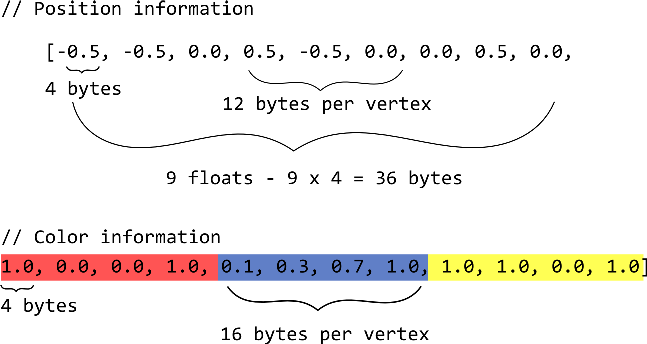
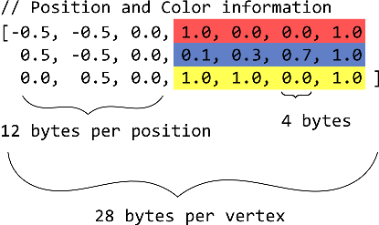
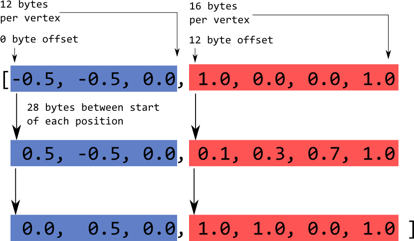

02 - Colors, Drawing, and Shaders
=================================

In the first lesson, we looked at the basics of setting up a WebGL context and drawing, but we didn't really touch on the full power of WebGL.  Obviously, drawing a basic triangle to the screen is not impressive in comparison to the special effects of movies and highly detailed video games, so how do they accomplish so much more?  We'll begin to dig into more detail about more powerful methods and drawing capabilities of WebGL in this lesson.

Triangles And Colors
--------------------

When the triangle was drawn in the previous demo, we set up the buffers, set up the vertices as an attribute, then made a call to `drawElements` to actually render the triangle.  Already, a lot is happening here with the numerous function calls and various arguments supplied to these functions, so what really is going on here and how can we use it?

First, let's take a look at attributes.  If we take a look at the basic vertex shader that was used in lesson 1, we can see above the main function, a variable is declared as an "`attribute`":

    attribute vec3 aPosition;

    void main() {
        gl_Position = vec4(aPosition, 1.0);
    }

and that's no accident!  That attribute is what we used to get the vertices' positional information into the shader to draw.  What is an `attribute` you ask?  Simple! It's any value that is supplied for each vertex.  For our example, each vertex had a position, so our only `attribute` is a 3-element vector of positional information `[x,y,z]`.  Often times, you may want to add more information for each vertex, like a color to be used, a texture coordinate, or a vector normal to the surface at that vertex.  Essentially any value that varies per vertex will be an `attribute` in the shader.  In our JavaScript code, that means we will have to retrieve another attribute location, and set up another attribute pointer, and then this data will be sent off to the graphics card!

However, what if you want to specify a *global* property of an object?  Maybe we want to specify the color of the entire triangle or tell the shader whether or not to use lighting with this object?  For that, we can set a `uniform` variable.  Unlike `attribute`s, `uniforms` stay constant across all vertices drawn in a single draw call.  This way we can set variables that affect all vertices equally, like a color or transformation (i.e. all vertices should be shifted to the left by 2 units).  So let's make use of this `uniform` concept, and specify the color of the triangle through the JavaScript code instead of inside the shader.

First, let's modify the vertex shader to accept a `uniform` for color information.  Since we want to supply color information across the whole object, we'll use a `uniform vec4` for a 4 element color `[r, g, b, a]`.  Here's the new shader:

    attribute vec3 aPosition;

    uniform vec4 uColor;

    void main() {
        gl_Position = vec4(aPosition, 1.0);
    }

But we have seen before that color information is used in the fragment shader, not the vertex shader, so how can we transfer the information?

To do this, we'll have to introduce the third type of shader variable, `varying`.  If one `varying` is specified in the vertex shader as `vColor`, and another `varying` is specified in the fragment of the name `vColor`, we can transfer information between shaders.  In the vertex shader, we'll modify the `main` code:

    attribute vec3 aPosition;

    uniform vec4 uColor;

    varying vec4 vColor;

    void main() {
        gl_Position = vec4(aPosition, 1.0);

        vColor = uColor;
    }

And add the `varying` to the fragment shader, using it for the fragment color:

    precision mediump float;

    varying vec4 vColor;

    void main() {
        gl_FragColor = vColor;
    } 

Now if we send a color to the vertex shader, it will get sent to the fragment shader and used to color our vertices!  As a final note, `varying` is used between shaders, and `uniform` and `attribute` is used to get data from the JavaScript code to the shader code.

To see this change in action, we need to head back to our JavaScript code and make use of this `uniform`.  First, we must get the location of this uniform similar to how we retrieved the attribe location.  To do this, we'll add a line in the `initShaders` function to retrieve another location from the shaders, this time the location of our color uniform:

    // Get the uniform/attribute locations
    gl_program_loc.aPosition = gl.getAttribLocation(gl_program, "aPosition");
    gl_program_loc.uColor = gl.getUniformLocation(gl_program, "uColor");

Note the change of function from `getAttribLocation` to `getUniformLocation` because we are retrieving a `uniform` and not an `attribute`.  The location is stored in the global variable `gl_program_loc` property, `uColor`.  

With the location of the uniform,  data can be stored in the uniform.  This is done in the draw method as follows: 

    // Use the created shader program
    gl.useProgram(gl_program);

    // Send color uniform to the shader:
    gl.uniform4fv(gl_program_loc.uColor, Float32Array([ 0.0, 1.0, 0.0, 1.0 ]));

And that's it, the triange should now be drawn as green, and to change the color, we can simply modify the JavaScript code!  Remember, this line has to be placed after the call to `useProgram` because the uniform that is receiving information is stored in the program `gl_program`, so it must be the active program before we can access it's locations.

What we have done here may seem a little silly, why did we upload a uniform to the vertex shader, then pass it to the fragment shader without modification?  Couldn't we have just gave the fragment shader the information directly by placing the uniform there:

    //Vertex Shader
    attribute vec3 aPosition;
        
    void main() {
        gl_Position = vec4(aPosition, 1.0);
    }

    //Fragment Shader
    precision mediump float;

    uniform vec4 uColor;
    
    void main() {
        gl_FragColor = uColor;
    } 

Why yes we can!  Without any modification of our JavaScript, this code will work just fine!  But now we also know how to pass different variables through shaders, and we'll make use of this shortly.

Now we can specify a single color for the whole object to use, but what if we wanted to specify a different color for each vertex?  How would we accomplish such a thing, and what would it even look like?  Let's experiment, and get a good look at how these shaders actually work!

First, we'll revert our shader back to having the color passed into the vertex shader, with one modification:

    // Vertex Shader
    attribute vec3 aPosition;
    attribute vec4 aColor;
    
    varying vec4 vColor;
    
    void main() {
        gl_Position = vec4(aPosition, 1.0);
        vColor = aColor;
    }

    // Fragment Shader
    precision mediump float;
    
    varying vec4 vColor
    
    void main() {
        gl_FragColor = vColor;
    }        

The major change made was to change the color to be `attribute`.  And we know this is the case, because we know that an `attribute` should be used if a variable changes depending on the vertex.

Now, let's head into the JavaScript again to use this new color information.  We first change the location retrieval to get an `attribute`:

    // Get the uniform/attribute locations
    gl_program_loc.aPosition = gl.getAttribLocation(gl_program, "aPosition");
    gl_program_loc.aColor = gl.getAttribLocation(gl_program, "aColor");

We want to populate that attribute with information, so we'll need to store it in a buffer to upload it to the graphics card.  But how can we do that since only one `ARRAY_BUFFER` can be active at a time?  

In order to store this information, we'll have to store the color information in the *same* buffer as the color information.  Since we don't want to mess up the positional information, we can just tack the color info at the end of the array:

    // Put 3 vertices of a triangle in the VBO
    var vertices = new Float32Array([ -0.5, -0.5, 0.0,      // Position 1
                                       0.5, -0.5, 0.0,      // Position 2
                                       0.0,  0.5, 0.0,      // Position 3    
                                       1.0,  0.0, 0.0, 1.0, // Color 1 - Red
                                       0.1,  0.3, 0.7, 1.0, // Color 2 - Blue
                                       1.0,  1.0, 0.0, 1.0, // Color 3 - Yellow
                                   ]);

We still have 3 vertices, so the element array doesn't need to change.  However, we need to modify the `draw` function to reflect our buffer changes.

First things first, we remove the `uniform4fv` call from the `draw` function as we are not using a uniform anymore.  Next, we enable a vertex attribute array for our color information:  

    // Enables a vertex attribute array for vertex positions and colors
    gl.enableVertexAttribArray(gl_program_loc.aPosition);
    gl.enableVertexAttribArray(gl_program_loc.aColor);

Finally, we have to handle the `attribute` pointers.  The position pointer was setup by:

    gl.vertexAttribPointer(gl_program_loc.aPosition, 3, gl.FLOAT, false, 12,  0);

with the `attribute` `aPosition`, `3` elements per vertex, all of type `FLOAT`, non-normalized, taking up 12 bytes total, starting at position 0.  So how do we setup the color pointer?  

We can setup the color attribute pointer by:

    gl.vertexAttribPointer(gl_program_loc.aPosition, 3, gl.FLOAT, false, 12,  0);
    gl.vertexAttribPointer(gl_program_loc.aColor,    4, gl.FLOAT, false, 16, 36);

But where did these new numbers come from?  Is there some magical method?  Well, not really, it just takes some reasoning about how the data is stored in the buffer.  Take a look at the following diagram:

This splits the positional and color information up so that it's easier to see what the offsets should be.  First off, we know that there are `4` non-normalized color float values per vertex, so that the call quite evidently starts with:

    gl.vertexAttribPointer(gl_program_loc.aColor, 4, gl.FLOAT, false, 

But that leaves the `stride`, number of bytes between vertices, and the `offset`, number of bytes from the beginning of the buffer to the first value.  From the diagram, we can easily see that each position value is a 4-byte float, with 12 bytes per vertex.  There are 3 vertices of 3 floats each, giving us 9 floats times 4 bytes = 36 bytes from the start of the buffer to the first color value.  Next, we see 4 floats per vertex for the color information, so we get 4 floats times 4 bytes = 16 bytes per vertex.  Filling in those values gives us the final function call:

    gl.vertexAttribPointer(gl_program_loc.aColor, 4, gl.FLOAT, false, 16, 36);

Easy, right?  This sort of calculation is pretty simple to do, as long as you're careful and double check your logic.  

So now, our triangle has a unique color per vertex, so let's see what that looks like!

    [index2-02 canvas]

Well, that's certainly interesting.  Each vertex has the color that we specified, but what's going on in the middle of the triangle?  We didn't specify any additional colors or add any code to gain this behavior to do this, so what's going on here?

Shaders
-------
There is a little more going on here than it seems, and all of it comes from the shaders.  The name "shader" comes from it's orignal purpose, to modify light and darkness in the image during the render.  Now they are sort of all purpose mini programs that run on the graphics card that can modify vertex position, color, and various other things.  That doesn't seem like a whole lot, but it actually offers a ton of flexibility and many realistic and interesting effects can be done using them, as we'll see.  

Shaders are written in a special shading language called GLSL, or the OpenGL Shading Language.  We're writing code using WebGL, but WebGL's spec is derived from OpenGL ES, so they share the same shading language, which is great for us because its a well defined and documented language with many examples readily available.  Thus far, we've thrown around terms such as "Vertex Shader" and "Fragment Shader" as if it was just something required by WebGL, but now we'll discuss their purpose and how they function.  

A *Vertex Shader* is a shader that operates on each *vertex*, with its main use to modify the vertex's position.  We saw that in our earlier shaders by setting the special variable `gl_Position` equal to the vertex position.  However, often it's not that simple.  Typically, a scene will have a moving camera in it, and every time the camera is moved, we don't want to update all of the vertex positions manually, instead this is done in the vertex shader.  And while this may seem like the same idea, the vertex shader runs on as many vertices as possible simultaneously, which means this calculation can be done *much* faster than if we did it in the CPU code.  

The main use of the vertex shader is setting the vertex's position based on the objects location and current projection, but it is also responsible for telling the fragment shader other properties of the vertex.  We saw this in the previous example, where the vertex shader uses the color attribute, and passes the color on to the fragment shader in a `varying` variable.  The shaders can have a large number of variables if there are a lot of properties that change per vertex and influence the color.

The other main shader type is the "Fragment Shader".  The main purpose of the fragment shader is to determine the final color of a pixel on the screen.  The fragment shader runs once for every pixel that needs coloring.  For our triangle, this means that the fragment shader runs once for the pixels in the middle of the canvas that make up the triangle.  It's job is to output a final color in the `gl_FragColor` variable, making use of any `varying`s that may have been passed in.  However, since the fragment shader is running once *per pixel* while the vertex shader is passing in values once *per vertex*, how does it determine which value of a varying to use at a particular pixel?  

The answer is simple: each `varying` is calculated by mixing the values of all vertices that affect the fragment by "linear interpolation".  The value of a `varying` at a particular is not obtained by taking the value of the closest, but rather by interpolating between all of the `varying` values at all of the points of the affecting shape (line or triangle).  The exact mathematics of this interpolation is not important for this discussion, but if you're interested you can read about it [here](http://en.wikibooks.org/wiki/GLSL_Programming/Rasterization).  This interpolation means that there is a smooth transition in color in the interior of the triangle between the colors of each vertex!  

Now that we know how these shaders operate, let's change them a bit.  Let's try making the following change to the shaders:

    // Vertex Shader
    attribute vec3 aPosition;
    attribute vec4 aColor;
    
    varying vec4 vColor;
    
    void main() {
        gl_Position = vec4(aPosition.x - 0.5, aPosition.yz, 1.0);
        vColor = vec4( aColor.r - aPosition.y, aColor.gba);
    }
    
    // Fragment Shader
    precision mediump float;
    
    varying vec4 vColor;
   
    void main() {
        gl_FragColor = vColor.bgra;
    }  

So what does this change do?  Well, in the vertex shader, we modify the color we send to the fragment shader by subtracting the `y` value of the position from the `r` value of the color.  Note that both `aPosition` and `aColor` are just `vec`'s, the notation `vec.x` and `vec.r` both refer to the first element in the vector, even though that value can be a position/color/anything else we would store in a vector.  So, this subtraction should make the red channel of the color much less vibrant for vertices with a positive `y` value, and more vibrant for vertices with a negative `y` component.  We've also modified the x position to shift left by 0.5.  Then, in the fragment shader, we swap the red and the blue channel of the color vector by accessing `vColor.bgra` instead of `vColor.rgba`.  Now, the blue values should be vibrant in negative `y` space, and non-existant in the positive `y` space, and red should only appear in the bottom right corner of the triangle where the blue was before!  Sure enough, we get the display that we expected:

    [ index2-03 canvas ]

This is just a simple modification in shaders.  Especially once we get to texturing and lighting we'll see more of how useful shaders can be, but just remember: Vertex shaders run once per vertex and pass `varying` values to the fragment shader.  These `varying` values are interpolated to fill in the inside of a shape smoothly in the fragment shader.  For global values `uniforms` can be used, and `attributes` are properties of a single vertex.  As a final note, if a constant value is desired apart from the JavaScript or any calculation, it is possible to declare a `const` value much like a `varying` or `uniform`.  These `const` values must be assigned a value when they are declared, and cannot be changed.  This is useful for a constant property of certain lighting system or any other such property that should remain across *all* objects drawn.

Interleaving and More Shapes
----------------------------

Now that we've seen how to pass multiple attributes to a shader, and how shaders work internally you may wonder if our method of sending color information to the graphics card is particularly efficient.  The answer (which you've probably guessed since it's being mentioned at all) is no.  In our example, we're drawing a single triangle so the performance is fine, but what would happen if we were attempting to draw some object that had more than 3 vertices, say, 10,000?  The vertex shader needs to retrieve both the position and the color information.  So say the first vertex is being loaded in; the positional information is at the front of the buffer, but the color information is 10,000 vertices times 3 components times 4 bytes = 120,000 bytes further in the buffer.  For each vertex this gap between it's position and color information only grows.  Jumping around in the buffer like this is not particularly efficient, and with such a large gap different parts of the buffer will have to be swapped in and out of the video card memory, so the draw call will take longer than it needs to.  

Obviously, storing the data separate like this is bad in terms of performance, but it is also suboptimal in terms of logic and reasoning.  Wouldn't it be easier to specify the position of a vertex, the color of that vertex, then the position of the next vertex, etc.?  In this way, we can even have some sort of structure that stores positional, color, and any other information about a vertex sequentially in memory, instead of having to store all positional data, then all color data, and hope that we've stored it in the right order.  

The good news is that doing this is quite easy with some careful modification of `vertexAttribPointer`.  First, we'll revert our shaders back to not changing position or color channels so that our triangle will look the same as it did when we first colored it.  Now, let's modify the vertex array:

    // Put 3 vertices of a triangle in the VBO
    //                              [    x,    y,   z,   r,   g,   b,   a ]
    var vertices = new Float32Array([ -0.5, -0.5, 0.0, 1.0, 0.0, 0.0, 1.0, // Vertex 1
                                       0.5, -0.5, 0.0, 0.1, 0.3, 0.7, 1.0, // Vertex 2
                                       0.0,  0.5, 0.0, 1.0, 1.0, 0.0, 1.0  // Vertex 3

With the color information appearing between positional information of vertices, we call this array "interleaved".

Now we need to modify how the attribute pointers are setup.  Let's take a look at the new structure of data:

Each vertex now starts with 12 bytes of `[x,y,z]` positional information, followed by 16 bytes of `[r,g,b,a]` color data, then another 12 bytes of position, etc., with 28 bytes total for a vertex.  For the vertex attribute pointer, this means that there is a 28 byte `stride` between vertices, and only a 12 byte `offset` until the first color information.  In code:

    gl.vertexAttribPointer(gl_program_loc.aPosition, 3, gl.FLOAT, false, 28,  0);
    gl.vertexAttribPointer(gl_program_loc.aColor,    4, gl.FLOAT, false, 28, 12);

Let's take a look at a diagram that illustrates what's going on:

Now we can see that it's pretty easy to organize vertex information like this and ship it to the graphics card, we just have to be pretty careful with the byte size of our vertices, and making sure if we add something to update the `stride` and `offset`s appropriately.

Individual triangles are good and all, but obviously, there are many more shapes in the world that we'd want to draw.  Let's modify our program to draw a simple square instead of a triangle (we're moving up in the world).  So how do we do that?  It's important to know that WebGL, OpenGL, OpenGL ES, and most other graphics systems don't work with anything more complicated than triangles because we can construct a realistic representation of anything by combining enough triangles.  So we'll make a square simply by combining two triangles.

First, we'll add a vertex to our vertex list, and modify positions to make a square instead of a triangle:

    //                              [    x,    y,   z,   r,   g,   b,   a ]
    var vertices = new Float32Array([ -0.5, -0.5, 0.0, 1.0, 0.0, 0.0, 1.0, // Vertex 1
                                       0.5, -0.5, 0.0, 0.1, 0.3, 0.7, 1.0, // Vertex 2
                                      -0.5,  0.5, 0.0, 1.0, 1.0, 0.0, 1.0, // Vertex 3
                                       0.5,  0.5, 0.0, 0.0, 1.0, 0.0, 1.0  // Vertex 4
                                   ]);

Next up, we'll add 3 indices to the index list to draw a second triangle:

    gl.bufferData(gl.ELEMENT_ARRAY_BUFFER, new Uint16Array([0,1,2,1,3,2]), gl.STATIC_DRAW);

Finally, simply update the number of vertices drawn in the `drawElements` call:

    gl.drawElements(gl.TRIANGLES, 6, gl.UNSIGNED_SHORT, 0);

And we'll see a nice square drawn!

    [ index2-05 canvas ]

Hardly looks like two triangles after all is said and done.  

We mentioned in the first lesson that the first argument to `drawElements` can be a number of different primitives.  The possible primitives are: 

 -  `POINTS` - Each point requires only one vertex, so one object is drawn for every vertex in the list.
 -  `LINE_STRIP` - Draws multiple lines where the endpoint of each line is the starting point of the next line.  For example, if given the list of vertices `v1, v2, v3, v4`, the lines `[v1,v2], [v2,v3], [v3,v4]` would be drawn.  There are 2 vertices per object, so with `N` vertices, `N-1` objects are drawn.  
 -  `LINE_LOOP` - Equivalent to `LINE_STRIP` but an extra line is drawn from the last point in the list to the first.  In the previous example, the lines drawn would be `[v1,v2], [v2,v3], [v3,v4], [v4,v1]`.  For `N` vertices, `N` objects are drawn.
 -  `LINES` - Draws individual lines, does not connect end points to start points.  In the previous example, the lines `[v1,v2], [v3,v4]` would be drawn.  For `N` vertices, `N/2` objects are drawn.
 -  `TRIANGLE_STRIP` - The first of the triangle primitives, much like `LINE_STRIP`, uses the last 2 vertices of one triangle for the first two vertices of the next triangle.  In the previous example, the triangles `[v1,v2,v3], [v2,v3,v4]` would be drawn.  With `N+2` vertices, `N` triangles are drawn.
 -  `TRIANGLE_FAN` - Similar to `TRIANGLE_STRIP`, but each triangle drawn uses the origin point and the last point of the previous triangle drawn instead of just the last two triangle points.  For the previous example, the triangles `[v1,v2,v3], [v1,v3,v4]` would be drawn.  As the name suggests, objects drawn by a `TRIANGLE_FAN` resemble a fan, with all triangles sharing the same origin point.  With `N+2` vertices, `N` triangles are drawn.
 -  `TRIANGLES` - The most basic of the triangle types, `TRIANGLES` similar to `LINES` draws individual triangles without sharing vertices.  In the previous example, there would only be enough vertices for one triangle: `[v1,v2,v3]`.  With `N` vertices, `N/3` triangles are drawn.

So WebGL offers a lot of different primitives to allow us to save repeating vertices when we have lots of shared vertices between triangles.  So let's do a simple modification of the previous program to use a `TRIANGLE_STRIP` to save on memory (6 vertices is *far* too much memory to handle, 4 is much better).  First, let's change the index list:

    gl.bufferData(gl.ELEMENT_ARRAY_BUFFER, new Uint16Array([0,1,2,3]), gl.STATIC_DRAW);

Now we only have 4 elements in the element array.  We can now change the `drawElements` call:

    gl.drawElements(gl.TRIANGLE_STRIP, 4, gl.UNSIGNED_SHORT, 0);

As expected, we get the same beautiful colored square:

    [ index2-06 canvas ]

Now we have seen how to handle color information (and incidentally how to handle any per vertex attribute), explored shaders in more depth, how to use different primitives, and how to combine triangles to make shapes.  In the next lesson, we'll revisit shaders as we make the leap to 3 dimensions, using projection and model matrices, and how to make our objects look a little more realistic.